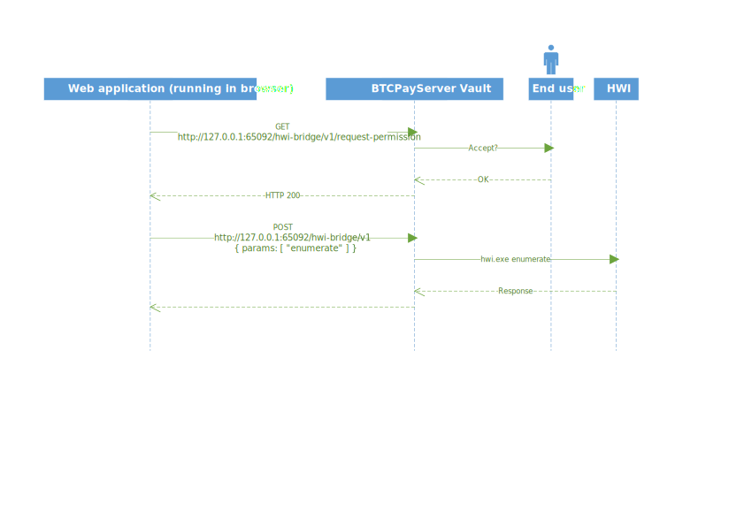

[](https://www.nuget.org/packages/BTCPayServer.Hwi) [](https://travis-ci.org/btcpayserver/BTCPayServer.Vault)

# BTCPayServer.Vault

This project is composed of two parts:

* [BTCPayServer.Hwi](BTCPayServer.Hwi): An easy to use library ([nuget](https://www.nuget.org/packages/BTCPayServer.Hwi)) wrapping the command line interface of the [hwi project](https://github.com/bitcoin-core/HWI).
* [BTCPayServer.Vault](BTCPayServer.Vault): A simple local web server providing access to the hardware wallet physically connected to your computer via hwi.

## Why BTCPayServer Vault

BTCPayServer Vault allows web applications to access your hardware wallet, this enables a better integrated user experience.

## How does BTCPayServer Vault work

When running the BTCPayServer Vault, a local webserver is hosted on `http://127.0.0.1:65092` which web applications, via your local browser, can connect to in order to interact with your hardware wallet.

The protocol is fairly simple:

First, the web application needs to make a permission request to the Vault by sending a HTTP request `GET` to `http://127.0.0.1:65092/hwi-bridge/v1/request-permission`

This will prompt the user to grant access to the web application and if the user accepts, the request returns HTTP 200. Note that internally, the Vault relies on the `ORIGIN` HTTP header to identify the web application requesting access.
If the access was granted previously, the request returns HTTP 200.

Second, the web application can query the hardware through `POST` requests to `http://127.0.0.1:65092/hwi-bridge/v1`.

```json
{
    "params": [ "param1", "param2" ]
}
````

Those parameters are then passed as-is to [hwi](https://github.com/bitcoin-core/HWI) and the result is returned as a string.



## Is it safe?

Hardware wallets have been created to protect your money, even if your computer was compromised.

However, while it protects your money, it will not protect your privacy if you allow an untrusted application to access your public keys.
This is why BTCPayServer Vault always ask permission to user first before allowing any web application to access your hardware wallet.

## How to build?

This is a two step process:

1. Install the latest version of the [.NET Core 3.0 SDK](https://dotnet.microsoft.com/download/dotnet-core/3.0)
2. Run `dotnet build`

If you want to run it for testing:

```bash
cd BTCPayServer.Vault
dotnet run
```

## Licence

This project is under MIT License.

## Special thanks

Special thanks to [Wasabi Wallet](https://github.com/zkSNACKs/WalletWasabi), this code is based on their work, and as well to the bitcoin developers and [achow101](https://github.com/achow101) for the [HWI Project](https://github.com/bitcoin-core/HWI).
